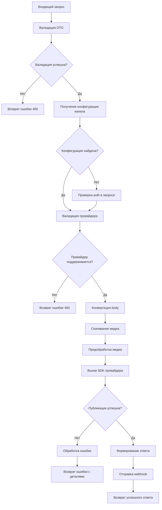

# PRD: Микросервис постинга в социальные сети

**Версия:** 1.0  
**Дата:** 2025-11-30  
**Статус:** Draft

---

## 1. Обзор

### 1.1. Назначение

Микросервис предназначен для публикации контента в различные социальные сети и платформы через единый унифицированный REST API. Микросервис **НЕ** занимается планированием публикаций (scheduling), а только выполняет непосредственную публикацию контента.

### 1.2. Технологический стек

- **Framework:** NestJS (v10+)
- **HTTP Server:** Fastify
- **Runtime:** Node.js 22+
- **Package Manager:** pnpm 10+
- **Language:** TypeScript

### 1.3. Основные возможности

- Публикация различных типов контента (посты, статьи, видео, аудио и т.д.)
- Поддержка множественных социальных сетей через единый API
- Автоматическая конвертация форматов контента (HTML → Markdown → Plain Text)
- Предобработка медиа-файлов
- Гибкая настройка авторизации для каждого канала
- Поддержка специфичных для платформ параметров

---

## 2. Функциональные требования

### 2.1. REST API

#### Эндпоинт публикации

```
POST /{API_BASE_PATH}/v1/post
```

#### Структура запроса

```typescript
interface PostRequest {
  // ============================================
  // ОБЯЗАТЕЛЬНЫЕ ПОЛЯ
  // ============================================
  
  /**
   * Уникальное имя социальной сети
   * @example "telegram", "x", "instagram", "youtube", "vk", "facebook", "tiktok", "mastodon"
   */
  platform: string;
  
  /**
   * Основной контент поста/статьи
   * @required true
   */
  body: string;
  
  // ============================================
  // ОПЦИОНАЛЬНЫЕ ПОЛЯ - ОСНОВНЫЕ
  // ============================================
  
  /**
   * Тип публикации (если соц. сеть поддерживает несколько типов)
   * @default "post"
   * @example "post" | "article" | "image" | "collection" | "video" | "short" | "audio" | "attachment"
   */
  type?: PostType;
  
  /**
   * Формат исходного контента в поле body
   * @default "text"
   * @example "html" | "md" | "text"
   */
  bodyFormat?: BodyFormat;
  
  /**
   * Автоматически конвертировать body в формат, требуемый соц. сетью
   * @default true
   */
  convertBody?: boolean;
  
  /**
   * Заголовок публикации (для платформ, требующих отдельный заголовок)
   * Примеры: Medium, Telegraph, YouTube видео
   */
  title?: string;
  
  /**
   * Описание/краткое содержание (для платформ, которым это требуется)
   * Примеры: YouTube, Instagram (первые строки)
   */
  description?: string;
  
  // ============================================
  // МЕДИА-КОНТЕНТ
  // ============================================
  
  /**
   * URL главного изображения (обложка поста/статьи/видео)
   */
  cover?: string;
  
  /**
   * URL видеофайла (для видеохостингов)
   * Поддерживается как короткие (shorts/reels), так и длинные видео
   */
  video?: string;
  
  /**
   * Массив URL медиа-файлов для скачивания
   * Используется для постов с медиа-коллекцией (карусели)
   */
  media?: string[];

  // ============================================
  // АВТОРИЗАЦИЯ И КОНФИГУРАЦИЯ
  // ============================================
  
  /**
   * Имя канала из конфига, содержащего параметры авторизации
   * @example "my_telegram_channel", "company_twitter"
   */
  channel?: string;
  
  /**
   * Данные авторизации, переданные напрямую в запросе
   * Используется если авторизация не хранится в конфиге
   * Структура зависит от конкретной соц. сети
   */
  auth?: Record<string, any>;
  
  // ============================================
  // ДОПОЛНИТЕЛЬНЫЕ ПАРАМЕТРЫ
  // ============================================
  
  /**
   * Специфичные для платформы параметры
   * Примеры:
   * - Telegram: inline_keyboard, parse_mode, disable_notification
   * - Twitter/X: reply_to_tweet_id, poll options
   * - Instagram: location, tagged_users
   */
  platformData?: Record<string, any>;
  
  /**
   * Теги/хэштеги для публикации
   */
  tags?: string[];
  
  /**
   * Запланированное время публикации (ISO 8601)
   * Поддерживается только если платформа имеет нативный scheduled posting
   * Примечание: микросервис не занимается внешним scheduling
   */
  scheduledAt?: string;
  
  /**
   * Язык контента в том виде в котором запрашивает соц. сеть
   * @example "ru-RU", "en", "es"
   */
  language?: string;
  
  /**
   * Режим публикации. Если поддреживает соц. сеть
   * @default "publish"
   */
  mode?: 'publish' | 'draft' | 'preview';
  
  /**
   * Уникальный идентификатор запроса для идемпотентности
   * Предотвращает дублирование публикаций при повторных запросах
   */
  idempotencyKey?: string;
  
  /**
   * Webhook URL для отправки статуса публикации
   */
  webhookUrl?: string;
}

enum PostType {
  POST = 'post',              // Обычный пост
  ARTICLE = 'article',        // Статья (Telegraph, Medium)
  IMAGE = 'image',            // Пост с изображением
  COLLECTION = 'collection',  // Медиа-карусель
  VIDEO = 'video',            // Видео
  SHORT = 'short',            // Короткое видео (Shorts, Reels, TikTok)
  AUDIO = 'audio',            // Аудио-файл
  ATTACHMENT = 'attachment',  // Пост с вложением (документ)
  STORY = 'story',            // История (Instagram Stories)
  POLL = 'poll',              // Опрос
}

enum BodyFormat {
  HTML = 'html',
  MARKDOWN = 'md',
  TEXT = 'text',
}
```

#### Структура ответа

**Успешная публикация:**

```typescript
interface PostResponse {
  success: true;
  data: {
    /**
     * ID публикации в социальной сети
     */
    postId: string;
    
    /**
     * URL опубликованного контента
     */
    url?: string;
    
    /**
     * Социальная сеть
     */
    platform: string;
    
    /**
     * Тип публикации
     */
    type: PostType;
    
    /**
     * Временная метка публикации (ISO 8601)
     */
    publishedAt: string;
    
    /**
     * Ответ от платформы как есть
     */
    raw?: Record<string, any>;
    
    /**
     * ID запроса для отслеживания
     */
    requestId: string;
  };
}
```

**Ошибка:**

```typescript
interface ErrorResponse {
  success: false;
  error: {
    /**
     * Код ошибки
     */
    code: string;
    
    /**
     * Сообщение об ошибке
     */
    message: string;
    
    /**
     * Детали ошибки
     */
    details?: Record<string, any>;
    
    /**
     * Ответ от платформы как есть
     */
    raw?: Record<string, any>;
    
    /**
     * ID запроса для отслеживания
     */
    requestId: string;
  };
}
```

#### Валидирует и возвращает предпросмотр того что будет отправлено на платформу

```
POST /{API_BASE_PATH}/v1/preview
```

---

## 3. Архитектура

### 3.1. Модульная структура

```
src/
├── app.module.ts
├── main.ts
├── config/
│   ├── config.module.ts
│   ├── config.service.ts
│   └── schemas/
│       └── providers.schema.ts
├── modules/
│   ├── post/
│   │   ├── post.module.ts
│   │   ├── post.controller.ts
│   │   ├── post.service.ts
│   │   └── dto/
│   │       ├── post-request.dto.ts
│   │       └── post-response.dto.ts
│   ├── providers/
│   │   ├── providers.module.ts
│   │   ├── base/
│   │   │   ├── base-provider.interface.ts
│   │   │   └── base-provider.abstract.ts
│   │   ├── telegram/
│   │   │   ├── telegram.provider.ts
│   │   │   ├── telegram.types.ts
│   │   │   └── telegram.config.ts
│   │   ├── facebook/
│   │   ├── instagram/
│   │   ├── twitter/
│   │   ├── youtube/
│   │   ├── vk/
│   │   └── ... (другие провайдеры)
│   ├── converter/
│   │   ├── converter.module.ts
│   │   ├── converter.service.ts
│   │   └── converters/
│   │       ├── html-to-markdown.converter.ts
│   │       ├── markdown-to-html.converter.ts
│   │       ├── html-to-text.converter.ts
│   │       └── markdown-to-text.converter.ts
│   ├── media/
│   │   ├── media.module.ts
│   │   ├── media.service.ts
│   │   └── processors/
│   │       ├── image.processor.ts
│   │       ├── video.processor.ts
│   │       └── audio.processor.ts
│   └── validation/
│       ├── validation.module.ts
│       └── validation.service.ts
└── common/
    ├── filters/
    ├── interceptors/
    ├── decorators/
    └── utils/
```

### 3.2. Провайдеры (Providers)

Каждый провайдер социальной сети реализует базовый интерфейс:

```typescript
interface IProvider {
  /**
   * Название провайдера
   */
  readonly name: string;
  
  /**
   * Поддерживаемые типы контента
   */
  readonly supportedTypes: PostType[];
  
  /**
   * Публикация контента
   */
  publish(request: PostRequest, config: ProviderConfig): Promise<PostResponse>;
  
  /**
   * Получение статуса публикации
   */
  getPostStatus(postId: string, config: ProviderConfig): Promise<PostStatus>;
  
  /**
   * Валидация запроса
   */
  validate(request: PostRequest): Promise<ValidationResult>;
  
  /**
   * Предпросмотр контента
   */
  preview(request: PostRequest): Promise<PreviewResult>;
}
```

### 3.3. Workflow публикации



---

## 4. Конфигурация

### 4.1. Структура конфига

Конфиг хранится в YAML формате и содержит именованные группы параметров для разных каналов.

**Путь к конфигу:** определяется через переменную окружения `CONFIG_PATH`

**Пример структуры (`config.yaml`):**

файл конфигурации должен быть расположен в корне проекта - config.yaml - он будет источником истины для понимания структуры конфигурации


```yaml
# Общие параметры
common:
  # Таймаут соединения с провайдером (сек)
  connectionTimeoutSecs: 45
  
  # Таймаут запроса (сек)
  requestTimeoutSecs: 60

  # Автоматическая конвертация body (по умолчанию)
  convertBody: true
  
  # Количество попыток при ошибке
  retryAttempts: 3
  
  # Задержка между попытками (мс)
  retryDelayMs: 1000

# Настройки конвертации
conversion:
  preserveLinks: true
  stripHtml: false

# Настройки медиа-обработки
media:
  # Сжатие изображений
  imageCompression:
    enabled: false
    quality: 85
    maxWidth: 2048
    maxHeight: 2048
  
  # Конвертация видео (если требуется)
  videoConversion:
    enabled: false

# Настройки провайдеров по умолчанию
providers:
  telegram:
    sdkVersion: latest
    maxRetries: 3

# Каналы (именованные конфигурации)
channels:
  # Telegram канал компании
  company_telegram:
    provider: telegram
    enabled: true
    auth:
      botToken: ${TELEGRAM_BOT_TOKEN}
      chatId: ${TELEGRAM_CHAT_ID}
    options:
      parseMode: HTML
      disableNotification: false
      convertBody: true
      bodyFormat: html
    limits:
      maxTextLength: 4096
      maxCaptionLength: 1024
  
  # остальные соц сети в следующих версиях

```

### 4.2. Переменные окружения

```bash
# Основные
NODE_ENV=production
LISTEN_HOST=0.0.0.0
LISTEN_PORT=8080
API_BASE_PATH=api
LOG_LEVEL=info
TZ=UTC

# Конфигурация
CONFIG_PATH=/app/config/config.yaml
```

---

## 5. Провайдеры социальных сетей

### 5.1. Приоритет разработки

**Этап 1 (MVP):**
1. ✅ **Telegram** — текстовые посты, фото, видео, документы

**Этап 2:**
2. **VK** — посты, фото, видео
3. **Twitter/X** — твиты, медиа

**Этап 3:**
4. **YouTube** — видео
5. **Instagram** — посты, stories, reels
6. **Facebook** — посты, видео

**Этап 4:**
7. **TikTok** — короткие видео
8. **Mastodon** — посты
9. **LinkedIn** — посты
10. **Medium** — статьи

### 5.2. Telegram Provider

**SDK:** `grammy`

**Поддерживаемые типы:**
- `post` — текстовый пост
- `image` — фото с подписью
- `video` — видео с подписью
- `collection` — медиа-группа (до 10 элементов)
- `attachment` — документ

**Специфичные параметры (`additional`):**

```typescript
interface TelegramAdditional {
  // Режим парсинга текста
  parseMode?: 'HTML' | 'Markdown' | 'MarkdownV2';
  
  // Встроенная клавиатура
  inlineKeyboard?: InlineKeyboardButton[][];
  
  // Отключить уведомление
  disableNotification?: boolean;
  
  // Отключить preview ссылок
  disableWebPagePreview?: boolean;
  
  // ID сообщения для ответа
  replyToMessageId?: number;
  
  // Защита от пересылки
  protectContent?: boolean;
}
```

**Пример запроса:**

```json
{
  "platform": "telegram",
  "type": "post",
  "channel": "company_telegram",
  "body": "<b>Привет!</b> Это тестовый пост с <a href='https://example.com'>ссылкой</a>",
  "bodyType": "html",
  "convertBody": false,
  "additional": {
    "parseMode": "HTML",
    "disableNotification": false,
    "inlineKeyboard": [
      [
        {
          "text": "Перейти на сайт",
          "url": "https://example.com"
        }
      ]
    ]
  }
}
```

---

## 6. Конвертация контента

### 6.1. Поддерживаемые конвертации

- HTML → Markdown
- HTML → Plain Text
- Markdown → HTML
- Markdown → Plain Text

### 6.2. Библиотеки

- **HTML → Markdown:** `turndown`
- **Markdown → HTML:** `marked` или `markdown-it`
- **HTML → Text:** `html-to-text`
- **Санитизация HTML:** `sanitize-html`

### 6.3. Логика конвертации

1. Если `convertBody = false`, контент передается как есть
2. Если `convertBody = true`:
   - Определяется требуемый формат для платформы
   - Выполняется конвертация из `bodyType` в требуемый формат
   - Применяются ограничения платформы (длина текста)
   - Применяется санитизация (если требуется)

---

## 7. Обработка медиа

### 7.1. Workflow

1. **Загрузка медиа:**
   - Скачивание по URL (если указан `media` или `cover`, `video`)
   - Или использование локальных файлов (если указан `mediaFiles`)

2. **Валидация:**
   - Проверка формата файла
   - Проверка размера файла
   - Проверка соответствия требованиям платформы

3. **Обработка:**
   - Сжатие изображений (если требуется)
   - Конвертация видео (если требуется)
   - Генерация превью (для видео)

4. **Загрузка на платформу:**
   - Через SDK платформы
   - Прямая загрузка через API

### 7.2. Ограничения платформ

| Платформа | Макс. размер фото | Макс. размер видео | Форматы фото | Форматы видео |
|-----------|-------------------|--------------------|--------------|-
|-----------|
| Telegram  | 10 MB             | 50 MB              | JPG, PNG, WEBP | MP4, MOV |
| Instagram | 8 MB              | 100 MB             | JPG, PNG      | MP4, MOV |
| Twitter/X | 5 MB              | 512 MB             | JPG, PNG, GIF, WEBP | MP4, MOV |
| YouTube   | —                 | 256 GB             | JPG, PNG (обложка) | MP4, MOV, AVI |
| VK        | 25 MB             | 6 GB               | JPG, PNG, GIF | MP4, AVI, MOV |

---

## 8. Обработка ошибок

### 8.1. Типы ошибок

| Код ошибки | Описание | HTTP Status |
|------------|----------|-------------|
| `VALIDATION_ERROR` | Ошибка валидации входных данных | 400 |
| `PROVIDER_NOT_FOUND` | Провайдер не найден | 400 |
| `CHANNEL_NOT_FOUND` | Канал не найден в конфиге | 404 |
| `AUTH_ERROR` | Ошибка авторизации | 401 |
| `PLATFORM_ERROR` | Ошибка от платформы | 502 |
| `MEDIA_DOWNLOAD_ERROR` | Ошибка загрузки медиа | 500 |
| `CONVERSION_ERROR` | Ошибка конвертации контента | 500 |
| `TIMEOUT_ERROR` | Превышено время ожидания | 504 |
| `RATE_LIMIT_ERROR` | Превышен лимит запросов | 429 |

### 8.2. Retry логика

- Автоматический retry для временных ошибок:
  - Сетевые таймауты
  - 5xx ошибки от платформы
  - Rate limit (с экспоненциальной задержкой)

- Количество попыток и задержки настраиваются в конфиге

---

## 9. Логирование и мониторинг

### 9.1. Логирование

**Библиотека:** Pino (уже настроена в бойлерплейте)

**Логируемые события:**
- Входящие запросы
- Валидация
- Конвертация контента
- Загрузка медиа
- Вызовы SDK провайдеров
- Ошибки
- Успешные публикации

**Уровни логов:**
- `trace` — детальная отладка
- `debug` — отладочная информация
- `info` — общая информация (успешные публикации)
- `warn` — предупреждения (retry, deprecated параметры)
- `error` — ошибки
- `fatal` — критические ошибки

### 9.2. Метрики

Рекомендуется интеграция с Prometheus:

**Метрики:**
- Количество запросов (по провайдерам)
- Количество успешных публикаций
- Количество ошибок (по типам)
- Время обработки запроса
- Время конвертации контента
- Размер загруженных медиа
- Rate limit события

---

## 10. Безопасность

### 10.1. Валидация входных данных

- Использование `class-validator` для DTO
- Санитизация HTML контента
- Проверка URL медиа-файлов (whitelist доменов)
- Ограничение размера запроса

### 10.2. Секреты

- Все токены и ключи хранятся в переменных окружения
- Использование секретов через Docker secrets / Kubernetes secrets
- Логирование не должно содержать токенов и ключей

---

## 11. Тестирование

### 11.1. Unit-тесты

- Тесты для каждого провайдера
- Тесты конвертеров
- Тесты валидации
- Тесты обработки медиа

### 11.2. Integration-тесты

- E2E тесты публикации (с моками SDK)
- Тесты конфигурации
- Тесты обработки ошибок

### 11.3. Мануальное тестирование

- Создание тестовых каналов в каждой соц. сети
- Проверка всех типов контента
- Проверка медиа-загрузки

---

## 12. Deployment

### 12.1. Docker

- Используется существующий Dockerfile из бойлерплейта
- Конфиг монтируется как volume
- Секреты передаются через environment variables

---

## 13. Roadmap

### Phase 1: MVP (Telegram) — 2-3 недели
- ✅ Базовая структура проекта (NestJS + Fastify)
- ⬜ REST API для публикации
- ⬜ Telegram Provider
- ⬜ Конфигурация
- ⬜ Конвертация HTML/Markdown
- ⬜ Обработка медиа
- ⬜ Unit-тесты
- ⬜ Документация API
- ⬜ Предпросмотр контента - /preview

### Phase 2: Расширение провайдеров — 3-4 недели
- ⬜ VK Provider
- ⬜ Twitter/X Provider
- ⬜ Улучшенная обработка медиа
- ⬜ Webhook уведомления
- ⬜ Idempotency

### Phase 3: Видео-платформы — 3-4 недели
- ⬜ YouTube Provider
- ⬜ Instagram Provider (посты, stories, reels)
- ⬜ TikTok Provider
- ⬜ Конвертация видео

### Phase 4: Дополнительные фичи — 2-3 недели
- ⬜ Facebook Provider
- ⬜ LinkedIn Provider
- ⬜ Mastodon Provider
- ⬜ Medium Provider

---

## Заключение

Данный PRD описывает микросервис для публикации контента в социальные сети с фокусом на гибкости, расширяемости и простоте использования. Архитектура позволяет легко добавлять новые провайдеры и функциональность без существенных изменений в кодовой базе.
